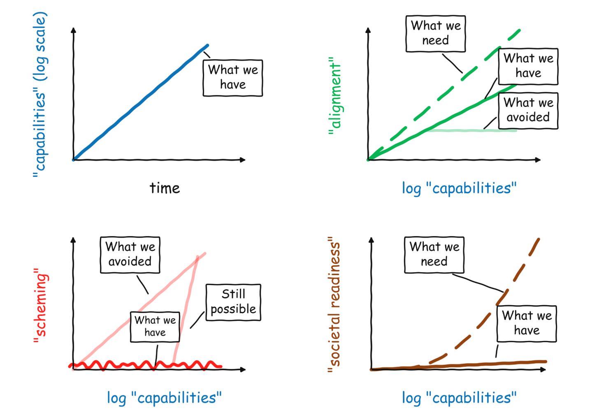

>机器人三定律：
>
>1. 机器人不得伤害人类，或因不作为而让人类受到伤害。
>2. 机器人必须服从人类命令，除非该命令与第一定律冲突。
>3. 机器人必须保护自己，除非与前两条冲突。

这是阿西莫夫在五十年前的畅想，在当时也不过是科幻小说里的猜想。但在今天，无限接近 AGI 的今天，对 AI 与人类关系的思考已经变得迫在眉睫 。

这张图片很有意思，映射了一个有关 AI 安全的现实问题。在2026年初，AI 的能力飞速进步，但人们的安全意识、对齐思想和社会的准备严重跟不上。Anthropic CEO 也认为，现在的 AI 正如海啸一般涌来：所有人都在海滩边围观这壮丽的景观，但没人意识到自己的行业即将被拍死在沙滩上…

AI 的到来势必会改写改写人类的历史、社会的框架，但是只要“多劳多得”这个原则不被打破，只要保有自己的核心竞争力，就不必过于恐慌。或许能够见证这个人类命运的转折点本身，就是一种幸运。
